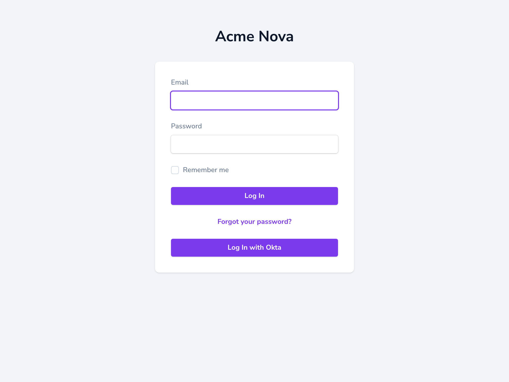

# Nova Okta

[](https://packagist.org/packages/bbs-lab/nova-okta)
[](https://github.com/BBS-Lab/nova-okta/actions/workflows/run-tests.yml)
[](https://packagist.org/packages/bbs-lab/nova-okta)

Okta SSO for Laravel Nova. Ships a custom Nova-styled login screen with a **Log In with Okta** button and an optional Fortify two-factor challenge bridge, so any Laravel Nova project gets Okta login by requiring the package and setting a few env vars. The login screen respects your Nova branding — it renders `nova.brand.logo` (or the name) and uses `nova.brand.colors` for the primary colour, including the Okta button.

It is the Nova adapter for [bbs-lab/laravel-okta](https://github.com/BBS-Lab/laravel-okta), which is installed automatically and owns the framework-agnostic Okta flow: the Socialite driver, the login / callback / logout controller, the user resolver, and the lifecycle hooks. **This package adds the Nova-specific parts** — the login screen, the login override and the 2FA bridge — and points the base flow at Nova's guard and path.



## Requirements

- PHP 8.2+
- Laravel 11, 12 or 13
- Laravel Nova 5

## Installation

Nova is a paid package, so authenticate against its Composer repository first, then require the package:

```bash
composer config http-basic.nova.laravel.com "your-nova-email" "your-nova-license-key"
composer require bbs-lab/nova-okta
```

Both service providers are auto-discovered.

### Okta application

In your Okta admin, create an **OIDC / Web** application and set:

- **Sign-in redirect URI**: `{APP_URL}/{nova-path}/authorization-code/callback`
- **Sign-out redirect URI**: `{APP_URL}/{nova-path}/authorization-code/callback/logout`

where `{nova-path}` is your `config('nova.path')` (e.g. `nova`, or empty when Nova is mounted at the root). These paths are configurable — see [Routes](#routes).

### Credentials

Add the `okta` block to `config/services.php` (the package intentionally does not own your credentials):

```php
'okta' => [
    'client_id' => env('OKTA_CLIENT_ID'),
    'client_secret' => env('OKTA_CLIENT_SECRET'),
    'redirect' => env('OKTA_REDIRECT_URI'), // optional — derived from the callback route
    'base_url' => env('OKTA_BASE_URL'),
    // 'auth_server_id' => env('OKTA_AUTH_SERVER_ID'), // optional custom authorization server
],
```

```dotenv
OKTA_CLIENT_ID=
OKTA_CLIENT_SECRET=
OKTA_BASE_URL=https://your-org.okta.com
```

`OKTA_BASE_URL` is the bare org URL (no `/oauth2`). Keep the `redirect` key present (it may be `null`).

**`OKTA_REDIRECT_URI` is optional.** The redirect URI is a route this package generates (under your
Nova path), so when it is not set the package derives it from the callback route
automatically — you only declare the matching **Sign-in redirect URI** in your Okta application. Set
it only to override the derived URL (e.g. behind a reverse proxy).

## Configuration

### Nova-specific options

```bash
php artisan vendor:publish --tag=nova-okta-config
```

```php
// config/nova-okta.php
return [
    // Replace Nova's GET login screen with the package's (carries the Okta button).
    'override_nova_login' => env('NOVA_OKTA_OVERRIDE_LOGIN', true),

    // Register the route('two-factor.login') bridge to Nova's 2FA challenge.
    'two_factor_challenge_route' => env('NOVA_OKTA_TWO_FACTOR_CHALLENGE', true),

    // Also render the Fortify email/password form next to the Okta button.
    'password_login' => env('NOVA_OKTA_PASSWORD_LOGIN', true),
];
```

### Okta behaviour (from the base)

The route paths, SSO logout, verified-email enforcement and stable-identifier matching live in the
base package's `config/okta.php`:

```bash
php artisan vendor:publish --tag=okta-config
```

```php
// config/okta.php
return [
    // Route paths, relative to the Nova path. Change these to move the endpoints
    // (update the Sign-in/Sign-out redirect URIs in Okta accordingly); the route
    // names never change.
    'paths' => [
        'login' => env('OKTA_LOGIN_PATH', 'authorization-code/redirect'),
        'callback' => env('OKTA_CALLBACK_PATH', 'authorization-code/callback'),
        'logout' => env('OKTA_LOGOUT_PATH', 'authorization-code/logout'),
        'callback_logout' => env('OKTA_CALLBACK_LOGOUT_PATH', 'authorization-code/callback/logout'),
    ],

    'sso_logout' => env('OKTA_SSO_LOGOUT', true),
    'require_verified_email' => env('OKTA_REQUIRE_VERIFIED_EMAIL', true),
    'identifier' => [
        'column' => env('OKTA_IDENTIFIER_COLUMN'), // e.g. 'okta_id'; null = email only
        'update' => env('OKTA_IDENTIFIER_UPDATE', true),
    ],
];
```

## User resolution, gating & lifecycle hooks

There is deliberately no user-mapping config — the base resolves an Okta account through Nova's
guard's own user provider (by a stable id column then a verified email, never creating a user), and
everything else is a hook on the `BBSLab\LaravelOkta\Facades\Okta` facade
(`resolveUserUsing`, `authorizeUserToLogin`, `beforeLogin`, `afterLogin`, `onLoginDenied`) or a
custom `BBSLab\LaravelOkta\Contracts\OktaUserResolver`.

> **The default resolver does not gate — it signs in any user it finds by email.** Deciding *who*
> may sign in is your job. Set an authorization rule for a Nova panel.

For Nova, gate the Okta sign-in and/or Nova's own access gate — for example in your
`App\Providers\NovaServiceProvider`:

```php
use BBSLab\LaravelOkta\Facades\Okta;
use Illuminate\Support\Facades\Gate;
use Illuminate\Support\Facades\Log;

public function boot(): void
{
    parent::boot();

    // Refuse the Okta sign-in itself unless the user is allowed
    // (they are never authenticated when a callback returns false).
    Okta::authorizeUserToLogin(fn ($user): bool => $user->is_active && $user->is_staff);

    // Optional: audit a refused login.
    Okta::onLoginDenied(fn ($user, $oktaUser) => Log::warning('Okta login denied', [
        'email' => $oktaUser->getEmail(),
    ]));
}

// Nova's native panel gate — defence in depth, checked on every Nova request.
protected function gate(): void
{
    Gate::define('viewNova', fn ($user): bool => $user->is_active && $user->is_staff);
}
```

`authorizeUserToLogin` stops a disallowed account at the SSO boundary (nothing is logged in, and
`onLoginDenied` fires); `viewNova` is Nova's own gate that also guards password logins and every
subsequent request. Use either or both.

See the [bbs-lab/laravel-okta README](https://github.com/BBS-Lab/laravel-okta#user-resolution--lifecycle)
for the hooks, the stable-identifier config, and how to extend `DefaultOktaUserResolver` for a
reusable gate. A denied login flashes the error to the custom login screen.

## How it works

The base registers the Okta Socialite driver and mounts these routes; this package adds the login
override and the 2FA bridge. **Every URI is prefixed by your Nova path** — `config('nova.path')`
(`nova` by default), read at boot — so with Nova mounted at `/backend-panel` the callback is
`/backend-panel/authorization-code/callback`. Below, `{nova-path}` stands for that prefix:

| Route (default URI) | Name | Purpose |
|-------------|------|---------|
| `GET {nova-path}/login` | `nova.pages.login` | Overrides Nova's login GET with the package screen (POST stays Fortify's `nova.login`). |
| `GET {nova-path}/authorization-code/redirect` | `nova-okta.login` | Redirects to Okta (start login). |
| `GET {nova-path}/authorization-code/callback` | `nova-okta.callback` | Login callback — resolves the user and logs them in (the Sign-in redirect URI target). |
| `GET {nova-path}/authorization-code/logout` | `nova-okta.logout` | Logs out locally, and — when `sso_logout` is on — via Okta's OIDC end-session (start logout). |
| `GET {nova-path}/authorization-code/callback/logout` | `nova-okta.callback.logout` | Okta's post-logout landing (sign-out redirect). |
| `GET {nova-path}/okta/two-factor-challenge` | `two-factor.login` | Redirects Fortify's 2FA step to Nova's own challenge (when enabled). |

The four `authorization-code/*` paths are **configurable** via the base package's `okta.paths` config (below); the route **names** are stable whatever the path, so reference them with `route('nova-okta.login')` rather than hard-coding a URI. When Nova is mounted at the root, `{nova-path}` is empty (e.g. `/authorization-code/callback`).

The 2FA bridge is a **redirect** to Nova's native `nova.two-factor.login` (not a re-registration of its URI), so Nova keeps its middleware and the bridge is `route:cache`-safe.

Point Nova's user-menu logout link at the Okta-aware logout in your `NovaServiceProvider`:

```php
use Laravel\Nova\Menu\MenuItem;

Nova::userMenu(fn ($request, $menu) => $menu->prepend(
    MenuItem::externalLink(__('Logout'), route('nova-okta.logout'))
));
```

### Two-factor and forced enrolment

The 2FA **challenge** bridge (`two-factor.login`) lets a 2FA-enabled user complete the second
factor on top of the custom login — enable Nova's 2FA in your `NovaServiceProvider`:

```php
Nova::fortify()
    ->features([Features::twoFactorAuthentication(['confirm' => true, 'confirmPassword' => true])])
    ->register();
```

Forcing **enrolment** in 2FA is out of scope here — use
[bbs-lab/nova-force-two-factor](https://github.com/BBS-Lab/nova-force-two-factor). On an
Okta login the base sets an `okta_authenticated` session flag so that package can skip forced
enrolment for SSO users (Okta already enforces MFA).

### Customising the login screen

```bash
php artisan vendor:publish --tag=nova-okta-views
php artisan vendor:publish --tag=nova-okta-translations
```

## Testing

```bash
composer test          # Pest (unit + feature)
composer test-coverage # 100% line coverage on src/
composer analyse       # PHPStan level 8
composer format        # Pint
composer serve         # boot a real Nova at http://localhost:8000/nova via Workbench
```

### Browser & live e2e

The browser (Pest v4) and live Playwright suites cover the pre-redirect login UX (the Okta button
and the start of the OIDC redirect); the full SSO round-trip needs a real Okta org.

```bash
npm install && npx playwright install chromium   # once
composer test:browser                            # Pest v4 browser tests
npm run e2e                                       # live Playwright scenarios (auto-starts serve)
```

## Security

- **Verified emails.** The base's default resolver rejects unverified Okta emails (`require_verified_email`). If you replace the resolver, keep an equivalent check.
- **Logout is a `GET`** (so it can be a Nova user-menu external link), which is why it relies on the framework's default `SESSION_SAME_SITE=lax` to prevent cross-site logout. Keep SameSite at `lax`/`strict`; if you set it to `none`, wire logout as a `POST` form instead.

Please email `paris@big-boss-studio.com` for security issues instead of the issue tracker.

## Changelog

See [CHANGELOG.md](CHANGELOG.md).

## Contributing

See [CONTRIBUTING.md](CONTRIBUTING.md).

## Credits

- [Big Boss Studio](https://github.com/BBS-Lab)

## License

The MIT License (MIT). See [LICENSE.md](LICENSE.md).
